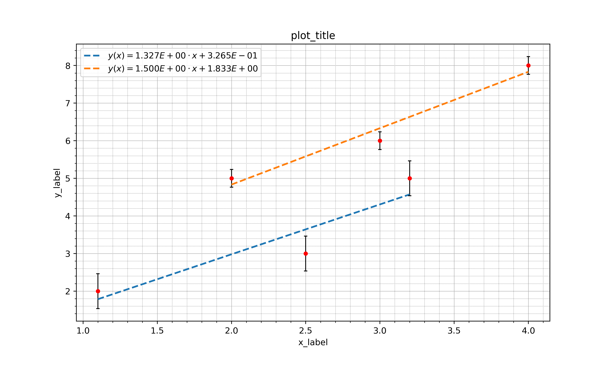

 # This is my package for plotting approximations

## Installation:

```bash
pip install plot-yar
```

## Description:

```python
plot_yar.Plot_approx(X_data, Y_data, input_function, plot_name='plot_name', plot_title='plot_title', 
x_label='x_label', y_label='y_label', Y_absolute_sigma = 0, scientific_view = True, print_cross = True, 
save_as_csv = False, to_latex = False, save_fig=True): 
```

### Parameters:

 -  __X_data:__ array_like.  
X-axis data
 

 -  __Y_data:__ array_like.  
Y-axis data


 -  __input_function:__ string.  
Approximation function.    
You could use template functions from dict or your own funcitons: 
 ```python
input_function = 'linear' 
fun_examples = {'linear':'a0*x+a1', 'poly_2':'a0*x**2+a1*x+a2', 'poly_3':'a0*x**3+a1*x**2+a2*x+a3',
'exp':'e^(a0*x+a1)+a2', 'ln':'ln(a0*x+a1)+a2'}
```
 - __plot_name:__ string.  
Name of your plot (picture)


 - __plot_title:__ string.  
Your plot title


 - __y_label:__ string.  
Y-axis label

 - __x_label:__ string.  
X-axis label


 - __Y_absolute_sigma:__ float or array_like.  
Absolute Y-axis data error


 - __scientific_view:__ bool. (default True)  
If True numbers will be written as $6.7 E + 01$ instead $670$


 - __print_cross:__ bool.  (default True)  
Print crosses error or not?

 - __to_latex:__ bool.  (default False)  
If True save table of estimated coeffs to latex table, you could use this package:
```latex
 \usepackage{booktabs}
```

 - __save_as_csv:__ bool.  (default False)  
If True save table of estimated coeffs to csv table


 - __save_fig:__ bool.  (default True)  
If True create a folder "pictures" and save plot to .png


### Example:
 - in:
```python
import plot_yar.plot_approx
plot_approx([[1,2,3]], [[2,3,5]], 'linear')
```

 - out:

```bash
Coeffs table 0: 

  coeffs  coeffs_values  standard error  relative se, %
0    a_0      1.500E+00       8.333E-02       5.556E+00
1    a_1      3.333E-01       3.889E-01       1.167E+02

Standart_error_Y_0 = 2.357E-01
```


